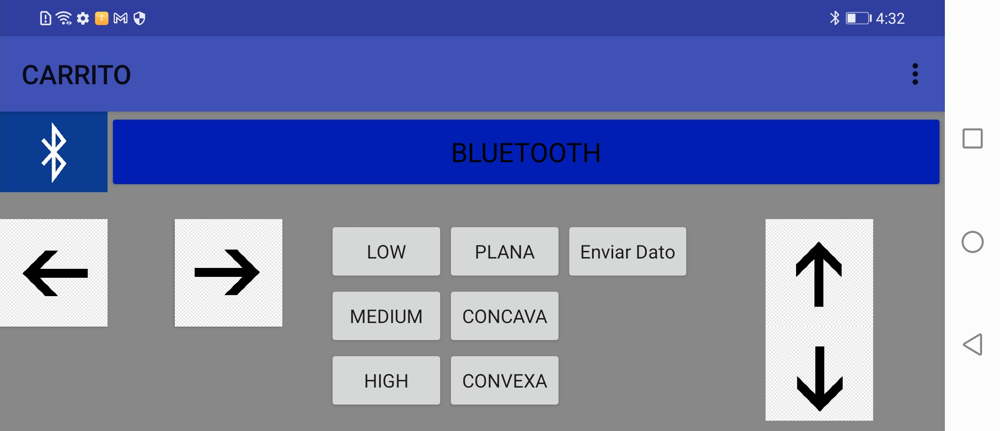
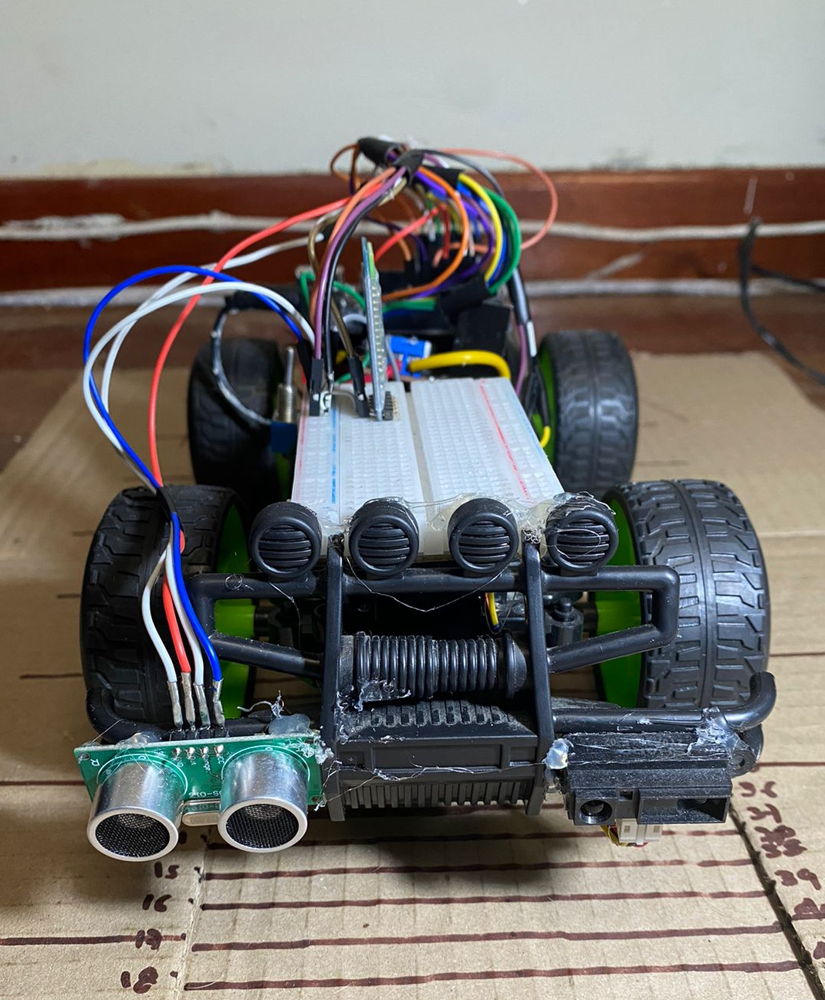
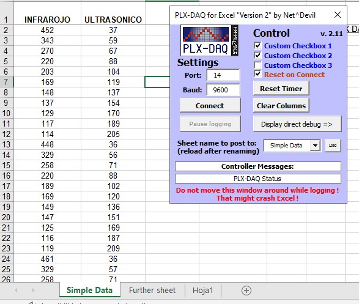

```{r setup, include=FALSE}
knitr::opts_chunk$set(echo = TRUE)
library(tidyverse) 
library(knitr)
library(psych)
library(caret)
folder <-  dirname(rstudioapi::getSourceEditorContext()$path )
wall.distance <-read_csv(paste0(folder,"/dataset_wall_distance.csv"))
dataset <- read_csv(paste0(folder,"/dataset_wall_distance.csv"))
wall.distance2 <- read_csv(paste0(folder,"/dataset_wall_distance.csv"))
type.wall.distance <-read_csv(paste0(folder,"/dataset_type_wall_distance.csv"))
##
```

## Introducción

El presente reporte está basado en la implementación de un aprendizaje de máquina para poder predecir tres tipos de obstáculos mediante el algoritmo de Knn y la distancia bajo un modelo lineal y otro multilíneal de dos sensores incorporados en un carro a control remoto. Este robot fue implementado en Arduino y una app móvil con el fin de obtener datos de un sensor infrarrojo y un ultrasónico a distancias y obstáculos diferentes.

## Materiales

-   Sensor ultrasónico US-016
-   Sensor Infrarrojo 2Y0A21 F
-   Modulo puente h l298n
-   Carro a control remoto
-   bluetooth hc-05
-   Arduino UNO

## Software

-   RStudio
-   Arduino
-   App inventor
-   Excel
-   PLX-DAQ

## Procedimiento

# 1.1 adquisision de datos

Se programo un carro a control remoto vía bluetooth capaz de moverse a diferentes velocidades y en cualquier dirección, este fue controlado con una app creada en app inventor la cual permitio controlar el movimiento del carro y enviar la acción para que envié el dato censado en ese momento.

<div>

<p style="text-align:center;">

{width="472"}

</p>

</div>

<div>

<p style="text-align:center;">

{withd="1%" width="285"}

</p>

</div>

Usando la comunicación Serial entre el Arduino y el módulo bluetooth se pudieron captar los datos de los sensores en Excel, para poder comunicar Excel con el Arduino se usó el software PLZ-DAQ

<div>

<p style="text-align:center;">

{withd="1%" width="221"}

</p>

</div>

# 1.2 Modelo lineal y regresion multilineal

Luego de tener el dataset de los datos tomados se carga la libreria tidyverse y el dataset

```{r, include=TRUE,echo=TRUE,eval=FALSE}
library(tidyverse)
folder <-  dirname(rstudioapi::getSourceEditorContext()$path )
wall.distance <-read_csv(paste0(folder,"/dataset_wall_distance.csv"))


```

Se hace el analisis exploratorio de datos para el dataset

```{r include=TRUE, echo=TRUE, eval=TRUE, warning=FALSE}

kable(summary(wall.distance))
```

De la tabla se puede identificar los valores maximos y minimos que se captaron con los sensores, de igual manera los valores por el primer quartil y el tercer cuartil

```{r include=TRUE, echo=TRUE, eval=TRUE, warning=FALSE}
hist(wall.distance$INFRARED,breaks = 10)
hist(wall.distance$ULTRASONIC,breaks = 10)

```

Debido a que la variable predictora es la distancia se tiene que pasar como factor,Graficando cada dato del sensor con la función hist se puede ver que los datos están distribuidos y que son viables para hacer aprendizaje de maquina

```{r include=TRUE, echo=TRUE, eval=TRUE, warning=FALSE}
wall.distance2$`DISTANCE(cm)` <-as.factor(wall.distance2$`DISTANCE(cm)`)
pairs(wall.distance[c("INFRARED","ULTRASONIC")]
,pch=25
,bg=c("green","blue3","gray","yellow","green3","pink","brown","black","red","orange")[unclass(wall.distance2$`DISTANCE(cm)`)])

```

Cuando se captaron los datos se identificó que un sensor crece inversamente al otro, graficando todos los datos en función a la distancia se notó que tienen una buena distribución y que se logran identificar grupos en todos los datos

```{r}
pairs.panels(wall.distance2[c("INFRARED","ULTRASONIC")]
             ,pch=21,bg=c("green","blue3","gray","yellow","green3","pink","brown","black","red","orange")[unclass(wall.distance2$`DISTANCE(cm)`)])
```

En esta grafica se ve mejor la relacion de las varibales y se ve que tiene una relacion negativa de -0.9, siendo esto un factor muy importante para poder hacer el aprendizaje de maquina

```{r}
kable(prop.table(table(wall.distance$`DISTANCE(cm)`)))
```

de los 110 datos que se obtuvieron hay la misma cantidad en cada distancia identificada -regresion lineal para sensor infrarojo

```{r}

x <- dataset$INFRARED
y <- dataset$`DISTANCE(cm)`
b=cov(x,y)/var(x)
a=mean(y)-b*mean(x)
a+b*121
```

-   regresion lineal para sensor infrarojo

-   Regresion Multilineal Para la regresion multilineal se van a tener dos predictores los cuales son los datos del infrarojo y del ultrasonico, se hace cross validation con el dataset dividiendlo en un 70% para entramiento y un 30% para prueba

```{r include=TRUE}
predictors <- c( "INFRARED", "ULTRASONIC")
sample.index <- sample(1:nrow(wall.distance)
                       ,nrow(wall.distance)*0.7
                       ,replace = F)
train.data  <-  wall.distance[sample.index
                                   ,c(predictors,"DISTANCE(cm)")
                                   ,drop=F]
test.data  <-  wall.distance[-sample.index
                                  ,c(predictors,"DISTANCE(cm)")
                                  ,drop=F]
```

Con la funcion lm se hace el modelo en funcion a la distancia y los datos con los que se va a entrenar son los del train.data

```{r eval=TRUE}
model<- lm(`DISTANCE(cm)` ~ INFRARED + ULTRASONIC,train.data)
summary(model)
predictions <- predict(model,test.data)
predictions
```

Para el caso del modelo multilineal se logra identificar que la variable que mas tiene relevancia en el entrenamiento es la de ULTRASOINIC, de los 33 datos que se tenian para hacer el test de prueba el modelo predijo correctamente las distancias de todos, para ver el error cuadratico medio se hizo lo siguiente

```{r}
RMSE.df <- data.frame(predicted = predictions
                      ,reales=test.data$`DISTANCE(cm)`
                      ,RSE = sqrt((predictions - test.data$`DISTANCE(cm)`)^2))
promedio_error <- sum(RMSE.df$RSE)/nrow(RMSE.df )
kable(head(RMSE.df))
promedio_error

```

# 2.1 Adquisición de datos

Para el modelo multilineal se obtuvieron nuevas medidas y una nueva variable la cual es el tipo de obstaculo, de las 4 variables se obtuvieron 198 muestras.

```{r}
kable(head(type.wall.distance))
```

```{r}
hist(type.wall.distance$INFRARED,breaks = 50)
hist(type.wall.distance$ULTRASONIC,breaks = 50)
```

A diferencia del primer dataset, en este se obtuvieron valores por fuera del rango normal como lo muestra la grafica del sensor ultrasonico.

```{r}
kable(summary(type.wall.distance))
```

Con la funcion summary se puede ver una division de los datos tanto del infrarojo como el del ultrasonido y cuales fueron sus valores maximos y minimos.

```{r}
type.wall.distance$TYPE <-as.factor(type.wall.distance$TYPE)

```

Debido a que la variable predictora es el tipo de obstaculo se tiene que pasar como factor, de cada

```{r}
plot(type.wall.distance[1:2]
     ,main=c("yellow = plano,blue=concavo,green=convexo")
     ,pch=21,bg=c("green","blue3","yellow")[unclass(type.wall.distance$TYPE)])
library(psych)
pairs.panels(type.wall.distance[1:2]
             ,main=c("yellow = plano,blue=concavo,green=convexo")
             ,pch=21,bg=c("green","blue3","yellow")[unclass(type.wall.distance$TYPE)])
```

En este dataset se cambio mucho la relacion entre las variables, se tiene una relacion del 0.03 que no es un buen indicio para aprendizaje de maquina pero aun asi se logran identificiar los tres grupos visualemente.

```{r}
dummy <- dummyVars(" ~ TYPE",data = type.wall.distance)

newdata <- data.frame(predict(dummy,newdata = type.wall.distance))

type.wall.distance <- cbind(type.wall.distance,newdata)
kable(head(type.wall.distance))
```

Se hace one hot encoding para la varibale TYPE, se tienen nuevas variables dummy y estas seran usadas como varibales predictoras para el aprendizaje de maquina.

```{r }

sample.index <- sample(1:nrow(type.wall.distance)
                       ,nrow(type.wall.distance)*0.7
                       ,replace = F)
predictors <- c("INFRARED","ULTRASONIC","TYPE.CONCAVA","TYPE.CONVEXA","TYPE.PLANA")


train.data  <-  type.wall.distance[sample.index
                                   ,c(predictors,"TYPE")
                                   ,drop=F]
test.data  <-  type.wall.distance[-sample.index
                                   ,c(predictors,"TYPE")
                                   ,drop=F]
```

para hacer el entrenamiento se hizo cross validation dividiendo el dataset en el 70% para entrenamiento y el 30% para prueba

```{r}
##KNN
ctrl <- trainControl(method = "cv",p=0.7) #variable de control
Knnfit <- train(TYPE ~ INFRARED+ULTRASONIC+TYPE.CONCAVA+TYPE.CONVEXA+TYPE.PLANA
                ,data = train.data
                ,method = "knn", trControl = ctrl
                ,preProcess= c("range")
                ,tuneLength=20)

Knnpredict <- predict(Knnfit,newdata = test.data)
confusionMatrix(Knnpredict
                ,test.data$TYPE)
```

Se entrena el algoritmo Knn en funcion de la variable TYPE y las variables predictoras son INFRARED,ULTRASONIC,TYPE.CONCAVA,TYPE.CONVEXA y TYPE.PLANA

con la matriz de confusion 3x3 se mira que de las muestras de test.data el algoritmo predice todas correctamente, tambien el accuary es de 1 y el p-value es menor a 2.2e-16 siendo este un valor muy importante estadisticamente.

de igual manera se ve la sensitividad y la especificidad son del 1.

```{r}
Knnpredict
```
<<<<<<< HEAD

## Validacion de modelos

Para la validacion de modelos tomamos muestras desde distancias mas grandes de las que utilizamos para la creacion del modelo, en otras palabras utilizamos rango fuera de los rangos de entrenamiento, para de esta manera comprobar la validez de los modelos creados. En este nuevo data set de validacion utilizamos rangos de distancia de los 65 a los 85 centimetros.

```{r}

x <- wall.distance$INFRARED
y <- wall.distance$`DISTANCE(cm)`
b=cov(x,y)/var(x)
a=mean(y)-b*mean(x)
a+b* 212
a+b* 223
a+b* 231
a+b* 235
a+b* 247


##Linear Regression For Ultrasonic Sensor
x <- wall.distance$ULTRASONIC
y <- wall.distance$`DISTANCE(cm)`
b=cov(x,y)/var(x)
a=mean(y)-b*mean(x)
a+b* 218
a+b* 240
a+b* 261
a+b* 276
a+b* 291

```

Validacion de modelos

Se evidencia en los resultados que en el sensor infrarojo fuera de rango pierde la exactitud y precision; y el sensor de ultasonido mantiene su exactitud y precision sin importar que esta por fuera del rango del modelo predictorio.

## Regresion lineal para el sensor Infrarojo, fuera del rango.

> a+b\* 212 [1] 34.35579 a+b\* 223 [1] 32.77144 a+b\* 231 [1] 31.61918 a+b\* 235 [1] 31.04306 a+b\* 247 [1] 29.31468

## Regresion lineal para el sensor de Ultrasonido, fuera del rango.

a+b\* 218 [1] 64.71935 \> a+b\* 240 [1] 71.38548 \> a+b\* 261 [1] 77.7486 \> a+b\* 276 [1] 82.29368 \> a+b\* 291 [1] 86.83877

## Reentrenamiento con un dataset de pruebas (data_pruebas)

```{r}


```
Se evidencia en los resultados que en el sensor infrarojo fuera de rango pierde la exactitud y precision; y el sensor de ultasonido mantiene su exactitud y precision sin importar que esta por fuera del rango del modelo predictorio.

Regresion lineal para el sensor Infrarojo, fuera del rango.

> a+b* 212
[1] 34.35579
> a+b* 223
[1] 32.77144
> a+b* 231
[1] 31.61918
> a+b* 235
[1] 31.04306
> a+b* 247
[1] 29.31468

Regresion lineal para el sensor de Ultrasonido, fuera del rango.

a+b* 218
[1] 64.71935
> a+b* 240
[1] 71.38548
> a+b* 261
[1] 77.7486
> a+b* 276
[1] 82.29368
> a+b* 291
[1] 86.83877
```
```{r}
##reentrenamiento con un dataset de pruebas (data_pruebas)

folder <-  dirname(rstudioapi::getSourceEditorContext()$path )
wall.distance <-read_csv(paste0(folder,"/dataset_wall_distance.csv"))
wall.distance2 <- read_csv(paste0(folder,"/dataset_wall_distance.csv"))
data_prueba <- read_csv(paste0(folder,"/DATASET_PRUEBA_LINEAL.csv"))
```


## Se hace un reentrenamiento

inplementando un nuevo dataset con los valores de distancia entre 65 y 85 para mirar el comportamiento de la regrecion multilineal con respecto a las funciones de prediccion el modelo. de esta forma los resultados odtenidos estuvieron semejantes entre el dataset y la prediccion

## Resultados de prediccion datos y del dataset del 65 a 85 1 2 3 4 5 6 7 8 9 64.28071 70.82564 77.07798 81.54730 86.00092 66.43089 70.28756 75.94490 80.73429

      10 

86.39164
=======
## se hace un rentrenamiento 
inplementando un nuevo dataset con los valores de distancia entre 65 y 85 para mirar el comportamiento de la regrecion multilineal con respecto a las funciones de prediccion  el modelo. de esta forma los resultados odtenidos estuvieron  semejantes entre el dataset y la prediccion

##resultados de prediccion datos y del dataset del 65 a 85
 1        2        3        4        5        6        7        8        9 
64.28071 70.82564 77.07798 81.54730 86.00092 66.43089 70.28756 75.94490 80.73429

      10 
86.39164 
>>>>>>> 480113853995acc4017db175efc4118a6aaf1886
